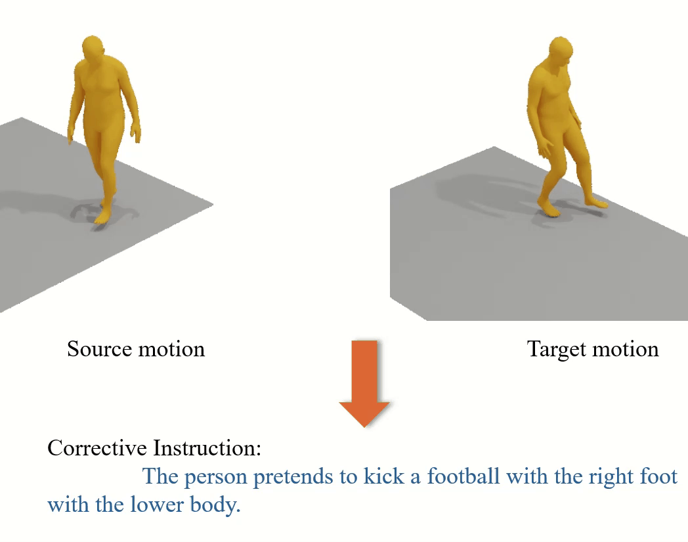








  I am a PhD student at the <a 
            href="https://datascience.hku.hk/">Institute of Data Science (IDS)</a>, <a 
            href="https://www.hku.hk/">The University of Hong Kong</a>, where I am honored to be advised by <a 
            href="https://yanchaoyang.github.io/">Prof. Yanchao Yang</a> and <a 
            href="https://people.eecs.berkeley.edu/~yima/">Prof. Yi Ma</a>. I am also an intern at <a 
            href="https://about.meta.com/realitylabs/">Meta the Reality Lab</a> where I am advised by <a 
            href="https://scholar.google.com/citations?user=WbG27wQAAAAJ">Dr. Chengcheng Tang</a>. I got the Master degree from <a 
            href="https://www.sdu.edu.cn/">Shandong University</a> supervised by <a 
            href="https://cfcs.pku.edu.cn/baoquan/">Prof. Baoquan Chen</a>. 
  My research focus lies in computer graphics, 3D vision, especially human motion understanding.

# 🔥 News
- *2024.09*: Our paper [CigTime: Corrective Instruction Generation Through Inverse Motion Editing](https://openreview.net/pdf?id=gktA1Qycj9) was accepted by ECCV 2022.
- *2022.07*: Our paper [Towards Accurate Active Camera Localization](https://arxiv.org/abs/2012.04263) was accepted by ECCV 2022.

# 📝 Publications 

NeurIPS 2024

CigTime: Corrective Instruction Generation Through Inverse Motion Editing

Qihang Fang, [Chengcheng Tang](https://scholar.google.com/citations?user=WbG27wQAAAAJ), [Bugra Tekin](https://btekin.github.io/), †[Yanchao Yang](https://yanchaoyang.github.io/)

[project page](https://github.com/qhFang/CigTime) [paper](https://openreview.net/pdf?id=gktA1Qycj9)  [code](https://github.com/qhFang/CigTime) <strong></strong>
- In this work, we propose a new motion-language model for generating corrective instructions. We present both qualitative and quantitative results across a diverse range of applications that largely improve upon baselines. Our approach demonstrates its effectiveness in instructional scenarios, offering text-based guidance to correct and enhance user performance.

ECCV 2022

Towards Accurate Active Camera Localization

*Qihang Fang, *[Yingda Yin](https://yd-yin.github.io/), †[Qingnan Fan](https://fqnchina.github.io/), [Fei Xia](https://fxia22.github.io/), [Siyan Dong](https://scholar.google.com/citations?user=vtZMhssAAAAJ&hl=en/), Sheng Wang, [Jue Wang](https://juewang725.github.io/), [Leonidas Guibas](http://geometry.stanford.edu/member/guibas/index.html), †[Baoquan Chen](http://cfcs.pku.edu.cn/baoquan/)

[arXiv](https://arxiv.org/abs/2012.04263) [bibtex](../QihangFang_files/eccv_2022_localization.bib) [code](https://github.com/qhFang/AccurateACL) <strong></strong>
- In this work, we explicitly model the camera and scene uncertainty components to solve the problem of active camera localization by reinforcement learning. Our algorithm improves over the state-of-the-art Markov Localization based approaches by a large margin on the fine-scale camera pose accuracy.

# 📖 Educations
- 2023.09 - Present, PhD student, Institute of Data Science (IDS), The University of Hong Kong. 
  - Advisor:  [Prof. Yanchao Yang](https://yanchaoyang.github.io/) and [Prof. Yi Ma](https://people.eecs.berkeley.edu/~yima/)
- 2020.09 - 2023.06, Master, Interdisciplinary Research Center (IRC), Shandong University. 
  - Advisor:  [Prof. Baoquan Chen](https://cfcs.pku.edu.cn/baoquan/)
- 2016.09 - 2020.06, B.E., Computer science and technology, Shandong University. 

# 💻 Internships
- 2024.10 - Present, Research intern in the Reality Lab.
  - Collaborator:  [Chengcheng Tang](https://scholar.google.com/citations?user=WbG27wQAAAAJ),  [Bugra Tekin](https://btekin.github.io/)
- 2021.07 - 2023.04, Research intern in Tencent AI Lab.
  - Collaborator:  [Qingnan Fan](https://fqnchina.github.io/),  [Xuelin Chen](https://xuelin-chen.github.io/),  [Jue Wang](https://juewang725.github.io/)
